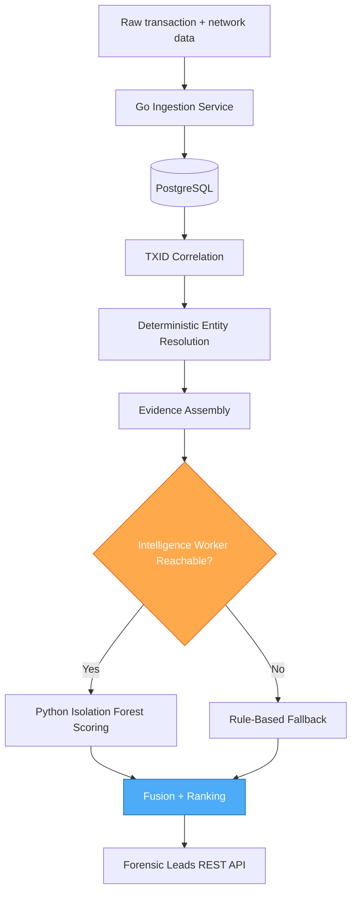
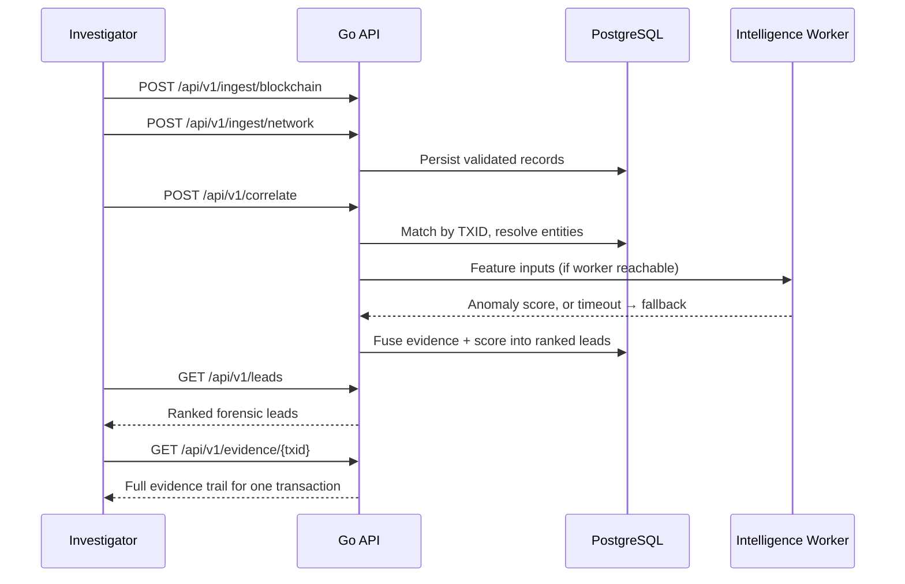

# TraceLayer

### Forensic Evidence Correlation for Offline Investigation Environments

[](https://go.dev/)
[](https://www.postgresql.org/)
[](https://www.python.org/)


TraceLayer correlates blockchain transactions with independently captured network observations, resolves which entities across the two sources are actually the same entity, and produces ranked forensic leads — built to run locally, without a live internet connection or a third-party service in the loop.

Built for **Smart India Hackathon 2026, problem statement SIH26146.**

---

## Table of Contents

- [TraceLayer](#tracelayer)
  - [Table of Contents](#table-of-contents)
  - [Problem](#problem)
  - [Approach](#approach)
  - [Project Status](#project-status)
  - [System Architecture](#system-architecture)
  - [Correlation Flow](#correlation-flow)
  - [Entity Resolution Model](#entity-resolution-model)
  - [What's Implemented and What's Not](#whats-implemented-and-whats-not)
  - [Tech Stack](#tech-stack)
  - [Dataset](#dataset)
  - [API](#api)
  - [Local Setup](#local-setup)
  - [Tests](#tests)
  - [Known Limitations](#known-limitations)
  - [Where This Goes Next](#where-this-goes-next)
  - [Team](#team)
  - [License](#license)

---

## Problem

An investigator working a blockchain-linked case usually has two data sources that were never designed to be read together: an on-chain transaction ledger, and network-level observations captured independently, often from a different agency or tool entirely. Lining these up by hand — matching a TXID here to an IP-and-timestamp cluster there, deciding which addresses are actually controlled by the same actor — doesn't scale past a handful of transactions, and doesn't hold up well when someone later asks how a lead was derived.

Most existing correlation tooling either assumes a live network connection to external enrichment services, or produces a similarity score with no way to trace it back to a specific rule. Neither works for an air-gapped investigation environment where a lead has to be defensible.

## Approach

TraceLayer is built around one governing rule: **every ranked lead has to trace back to a specific matching rule, not a black-box score.**

1. **Ingestion** — blockchain transactions and network observations are validated and persisted independently, in Go, against PostgreSQL.
2. **Correlation** — records are matched by transaction ID first, the one identifier both sources reliably share.
3. **Entity resolution** — deterministic, not learned. Same inputs produce the same entity graph every run, which matters when the output might end up cited in a report.
4. **Scoring (optional)** — a stateless Python worker can add an anomaly score on top of the deterministic matches. It's an enrichment layer, not a gate: if it's unreachable, correlation still produces leads, just without the extra score.
5. **Fusion and ranking** — matched evidence and (if available) scores combine into a ranked list of forensic leads, each queryable back to its source evidence.

Determinism is the deliberate trade-off throughout. A learned model that ranks leads directly would need labeled training data we don't have and would fail in ways that are hard to explain to an investigator. A rule that mismatches is debuggable in minutes and fails the same way every time.

## Project Status

| Component | Status |
|---|---|
| Go ingestion, validation, persistence | ✅ Implemented, tests passing |
| TXID correlation | ✅ Implemented |
| Deterministic entity resolution | ✅ Implemented |
| Evidence queries, fusion, ranking, forensic leads API | ✅ Implemented |
| Python intelligence worker | ✅ Built — on a separate branch, not yet merged into `main` |
| Frontend | ✅ Built — on a separate branch, calling routes not yet present in the current Go router |
| Offline / air-gapped operation | 🔲 Design goal — not yet verified end to end |

The backend in `main` runs and passes its test suite on its own. Getting the three pieces above onto one branch, talking to each other through the current API, is the immediate next step.

---

## System Architecture



The Go service owns every write and all orchestration. The Python worker never touches PostgreSQL directly — it receives feature inputs over HTTP and returns a score, nothing more. That boundary is deliberate: the correlation pipeline should keep producing leads even if the scoring service is down, degraded, or not yet deployed.

## Correlation Flow



## Entity Resolution Model

Resolution runs on common-input heuristics — deterministic rules over shared identifiers, not a trained classifier. Two records either match under a defined rule or they don't; there's no confidence percentage to interpret, which is the point. An investigator asking "why did the system link these two addresses" gets a rule name, not a probability.

The trade-off is coverage: a deterministic resolver will miss links that a trained model might catch, especially in adversarial cases designed to break simple heuristics. That's a known, accepted limitation for this stage of the project, not an oversight — see [Where This Goes Next](#where-this-goes-next).

## What's Implemented and What's Not

| Supported now | Not yet |
|---|---|
| Blockchain + network ingestion with validation | Graph storage / evidence subgraphs |
| TXID-based correlation | Runtime enrichment services |
| Deterministic entity resolution | External live-network integrations |
| Evidence queries by TXID | Multi-model intelligence scoring (only Isolation Forest currently) |
| Fusion, ranking, rank-shift, forensic leads | Frontend wired to the current API |
| Optional anomaly scoring via the intelligence worker | Verified offline/air-gapped runtime |

Not supported, by design at this stage: live blockchain/network feed ingestion (the pipeline is built around ingested files, not a streaming source), and any automated action on a lead — every lead is for an investigator to act on, not something the system acts on itself.

---

## Tech Stack

| Layer | Technology | Why |
|---|---|---|
| API / domain | Go | Fast to reason about under concurrency, predictable failure modes for ingestion and correlation |
| Database | PostgreSQL | Relational integrity for evidence chains, transactional writes on ingest |
| Intelligence scoring | Python, scikit-learn (Isolation Forest) | Stateless service, swappable without touching the Go domain |
| Frontend | Next.js | On a separate branch, pending API reconciliation |

## Dataset

Synthetic, reproducible, and pinned by manifest — under `data/synthetic/datasets/seed-42/data/raw/`:

- Dataset ID `6bc084b677a63411`
- Generator version `1.0.0`, seed `42`
- 109 transaction records, 368 network observation records

`data/synthetic/datasets/seed-42/data/eval/` is held out for evaluation only and is never consumed by ingestion or scoring — keeping eval data out of the pipeline it's meant to validate is a hard rule, not a convention.

## API

```text
GET  /health
POST /api/v1/ingest/blockchain
POST /api/v1/ingest/network
POST /api/v1/correlate
GET  /api/v1/evidence/{txid}
GET  /api/v1/leads
GET  /api/v1/leads/{id}
```

Full request/response shapes: [`docs/API_CONTRACT.md`](docs/API_CONTRACT.md), [`api/openapi.yaml`](api/openapi.yaml).

Intelligence worker (separate service, HTTP only, no DB access):

```text
GET  /health
POST /intelligence/score
```

One boundary detail worth flagging honestly: the Go domain tracks BTC amounts in exact satoshis, but the JSON schema sent to the Python worker currently carries them as floats. Fine for anomaly scoring, not something to carry into anything that needs to reconcile against a ledger.

## Local Setup

Requires a reachable PostgreSQL instance and a `DATABASE_URL` environment variable. The API listens on `:8080` by default:

```bash
go run ./cmd/api
```

Submit the seed-42 files through the two ingestion endpoints, then call `/api/v1/correlate`.

## Tests

```bash
go test ./...
```

Passes clean in the working tree. That covers the Go domain logic — it does not cover a containerized deployment, the Python integration path, or a genuinely air-gapped run.

## Known Limitations

- `/api/v1/correlate` doesn't yet run its stages inside one shared database transaction, so a mid-pipeline failure can leave partial state.
- Falls back to a heuristic score, not a hard failure, when the intelligence worker is unreachable — deliberate, but worth knowing before relying on the score field.
- Satoshi-vs-float mismatch at the Go/Python boundary, noted above.
- Offline/air-gapped operation is the design goal, not yet something verified end to end — build-time dependencies aren't confirmed to resolve from a local cache yet.

## Where This Goes Next

The correlation and ranking pipeline is deterministic on purpose — every fused lead traces back to a rule you can point at, which matters for output that might end up in an investigator's report. The next layer of work is on the intelligence side: moving past the current Isolation Forest baseline into proper model selection, comparing it against alternative anomaly-detection approaches on harder synthetic scenarios, and tightening fusion/ranking weights against labeled leads instead of hand-tuned defaults — plus finishing the merge of the intelligence worker and frontend branches into the current API contract.

## Team

Built for SIH26146 by a three-person team. Dipak: Go backend — domain validation, PostgreSQL persistence, TXID correlation, fusion/ranking pipeline. Teammates: intelligence worker and frontend.

## License

Not yet decided. To be added before any public release.
